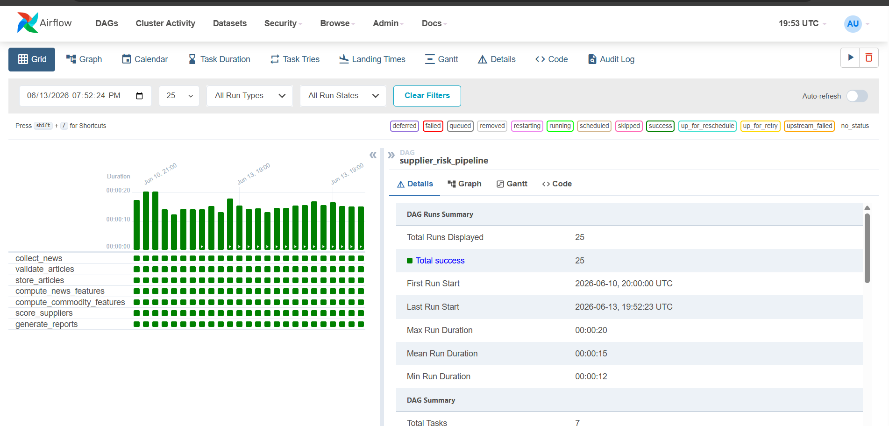
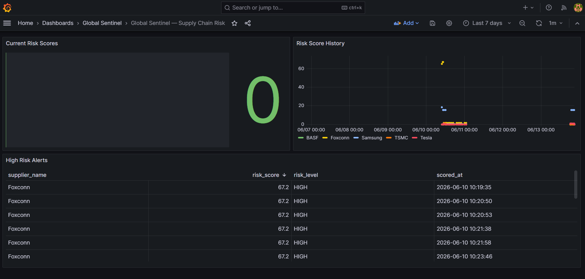

# 🛡️ Global Sentinel — AI-Powered Supply Chain Risk Intelligence Platform

> Real-time supplier risk monitoring using news signals, commodity prices, ML scoring, and LLM-generated alerts.

## The Problem

Companies discover supplier failures too late. By the time a bankruptcy, geopolitical disruption, or production delay becomes visible, the damage is done. **Global Sentinel detects early warning signals before they escalate.**

## Live Demo

### Airflow Pipeline — 25 Runs, 100% Success

*7-task pipeline running every hour: collect → validate → store → features → score → report*

### Grafana Real-Time Dashboard

*Live risk scores, 7-day history, and HIGH risk alerts with timestamps*

## Architecture

